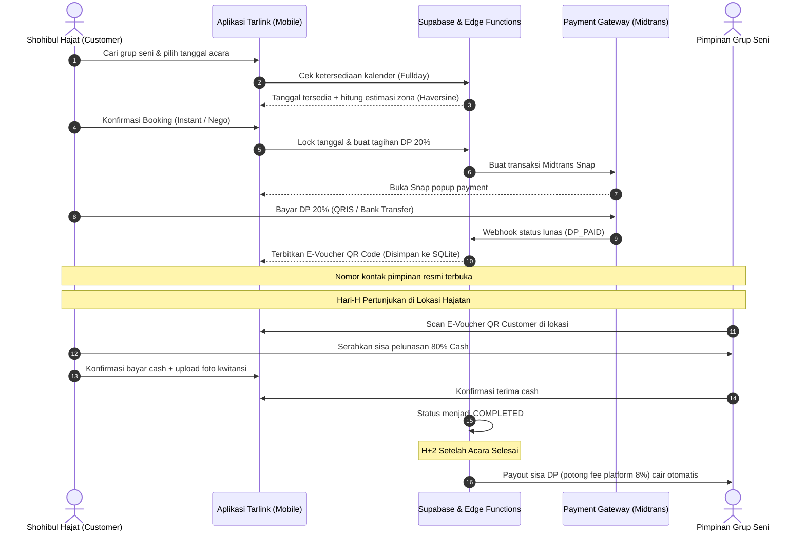

<p align="center">
  
</p>

<h1 align="center">Tarlink</h1>

<p align="center">
  <strong>Platform Marketplace & Booking Digital Seni Pertunjukan Pantura</strong><br>
  <em>Sandiwara Tarling • Dangdut Pantura • Organ Tunggal • Kesenian Tradisional Indramayu & Cirebon</em>
</p>

<p align="center">
  
  
  
  
  
</p>

---

## 📖 Tentang Tarlink

**Tarlink** adalah platform marketplace digital mandiri yang dirancang khusus untuk ekosistem hiburan rakyat dan seni panggung Pantura (khususnya wilayah Indramayu, Cirebon, Majalengka, Kuningan, dan Subang). 

Tarlink menjembatani **Shohibul Hajat (Tuan Rumah Hajatan / Bu Hajat)** dengan **Pimpinan Lapak Grup Seni (Artis, Dalang, Sandiwara, Organ Tunggal)** secara aman, transparan, terstandardisasi, dan ramah pengguna di pedesaan.

Aplikasi ini mengatasi masalah klasik booking panggung tradisional Pantura:
- ❌ Jadwal bentrok akibat pencatatan manual di buku agenda kertas.
- ❌ Ketidakpastian biaya akomodasi & jarak tempuh antar desa/kecamatan.
- ❌ Risiko pembatalan sepihak tanpa kejelasan uang muka (DP).
- ❌ Kontak langsung yang rawan penipuan atau percaloan tidak resmi.

---

## ✨ Fitur Unggulan

### 1. ⚡ Dual-Path Booking (Dua Jalur Pemesanan)
* **Instant Booking (Auto-Accept):** Pesan langsung paket pertunjukan standar layaknya platform travel modern dengan auto-lock kalender dan batas bayar invoice 30 menit.
* **Custom Nego (Maksimal 3 Ronde):** Fitur tawar-menawar harga dan durasi pertunjukan dengan batas waktu respon 12 jam per ronde untuk mencegah tawar-menawar tanpa akhir (PHP).

### 2. 📍 Auto-Hitung Jarak & Biaya Zona (Haversine Formula)
* Jarak dari markas grup (*Basecamp Lat/Lng*) ke lokasi hajatan pemesan (*Venue Lat/Lng*) dihitung otomatis secara presisi.
* Biaya akomodasi/zona transportasi dipetakan otomatis:
  * **Zona 1 (0 – 15 km):** Gratis / Termasuk paket.
  * **Zona 2 (15 – 35 km):** Tambahan transport lokal.
  * **Zona 3 (> 35 km):** Tambahan transport jarak jauh lintas kabupaten.

### 3. 🔒 Anti Double-Booking (Fullday Mutlak)
* 1 grup seni hanya dapat menerima **1 job aktif per tanggal** (sistem fullday panggung siang-malam).
* Dilindungi oleh *Partial Unique Index* di PostgreSQL:
  ```sql
  CREATE UNIQUE INDEX uniq_artist_date ON bookings(artist_id, event_date)
  WHERE status IN ('DP_PAID', 'PARTIAL_PAID', 'FULL_PAID', 'ONGOING');
  ```

### 4. 🛡️ Anti-Bocor Kontak (Platform Leakage Protection)
* Nomor telepon asli pimpinan grup disamarkan secara default (`0812-****-**78`).
* Nomor telepon asli hanya dibuka ke pemesan setelah pembayaran DP 20% diverifikasi lunas (`DP_PAID`).

### 5. 💳 Pembayaran Semi-Otomatis (Hybrid Model)
* **DP 20% Online:** Dibayar melalui payment gateway (Midtrans Snap: QRIS, GoPay, Transfer Bank VA) untuk mengikat kepastian jadwal.
* **Pelunasan 80% Tunai di Lokasi:** Dibayar langsung tunai oleh Bu Hajat kepada pimpinan grup pada Hari-H hajatan, kemudian dikonfirmasi dua arah via aplikasi dengan unggahan bukti foto kwitansi fisik.
* **Payout Otomatis H+2:** Sisa dana DP (setelah fee platform 8%) otomatis dicairkan ke rekening pimpinan grup H+2 setelah acara selesai.

### 6. 🎟️ E-Voucher QR Code dengan Offline Cache
* E-Voucher bukti pemesanan tersimpan di database lokal SQLite (`sqflite`).
* Tetap dapat dibuka dan menampilkan kode QR valid di lokasi hajatan pelosok desa tanpa koneksi internet.
* Pimpinan grup dapat memindai QR langsung menggunakan kamera scanner di aplikasi.

### 7. 🤖 Floating CS Bot In-App 24/7
* Widget bot bantuan interaktif melayang di sudut layar.
* Menjawab FAQ seputar adat hajatan Pantura, jam tayang sandiwara, tata cara DP, hingga bantuan untuk pengguna awam (*asisten gaptek*).
* Menangani eskalasi laporan sengketa (*dispute*) yang otomatis mengunci pencairan dana payout.

### 8. 👥 Multi-Role Terpadu dalam Satu Aplikasi
* **Customer (Pemesan):** Cari grup, filter tanggal/kota, nego, bayar DP, simpan e-voucher, beri ulasan bintang & foto.
* **Pimpinan Grup Seni:** Buka lapak grup, kelola paket manggung, blokir tanggal kalender manual, scan e-voucher, terima payout.
* **Admin Pasar:** Verifikasi KTP pimpinan grup, investigasi sengketa, pantau payout H+2.

---

## 🏗️ Arsitektur Proyek

Proyek dibangun menggunakan prinsip **Feature-First Clean Architecture** pada sisi mobile dan **Serverless PostgreSQL** pada sisi backend:

```text
Sistem/
├── docs/                             # Asset dokumentasi & branding
│   └── tarlink_logo.png              # Logo resmi aplikasi
│
├── mobile/                           # Frontend Flutter Mobile App
│   ├── android/                      # Native Android config & launcher icons
│   ├── assets/                       # Image assets, placeholder, icon
│   ├── lib/
│   │   ├── core/                     # Tema, konstanta, utils (Haversine, Currency)
│   │   │   ├── constants/            # Supabase API keys & endpoint config
│   │   │   ├── theme/                # Palet Terracotta & Heritage Warm Amber
│   │   │   ├── utils/                # Formatter Rupiah, Haversine, date utils
│   │   │   └── widgets/              # Komponen atomik (button, textfield, modal)
│   │   ├── features/                 # Modular Feature-First
│   │   │   ├── auth/                 # Login OTP & Akun Pengguna
│   │   │   ├── catalog/              # List artis, filter tanggal/kota, detail lapak, review
│   │   │   ├── booking/              # Form order, instant booking, nego 3 ronde, list booking
│   │   │   ├── payment/              # Midtrans Snap WebView, pelunasan cash Hari-H
│   │   │   ├── voucher/              # QR E-Voucher dengan SQLite offline cache
│   │   │   ├── chat_bot/             # Floating CS bot 24/7 & chat grup
│   │   │   ├── profile_group/        # Manajemen lapak grup seni & verifikasi KTP
│   │   │   ├── admin/                # Panel admin pasar, verifikasi, sengketa
│   │   │   └── notifications/        # Notifikasi status pemesanan & pembayaran
│   │   └── main.dart                 # Entry point aplikasi Tarlink
│   └── test/                         # 28 Unit & Widget Tests (TDD verified)
│
├── supabase/                         # Backend Serverless Supabase
│   ├── migrations/                   # Skema DDL, RLS, Trigger, Master Seed Data
│   │   ├── 20260907000001_initial_schema.sql
│   │   ├── 20260907000002_rls_policies.sql
│   │   ├── 20260907000003_seed_master_data.sql
│   │   ├── 20260907000004_artist_verification_trigger.sql
│   │   └── 20260907000005_seed_pantura_artists.sql
│   └── functions/                    # Edge Functions (Deno / TypeScript)
│       ├── create-booking/           # Kalkulasi jarak server-side, DP 20%, zone fee
│       ├── midtrans-hook/            # Webhook payment Midtrans (idempotent, SHA512)
│       ├── payout-auto/              # Worker pencairan otomatis H+2
│       ├── expire-worker/            # Worker expire otomatis invoice 30m & nego 12h
│       └── bot-engine/               # Mesin NLP kecerdasan buatan CS bot
│
├── AGENTS.md                         # Panduan teknis & standar coding agent
└── prd.md                            # Product Requirement Document lengkap
```

---

## 🔄 Alur Transaksi (Workflow)



---

## 🚀 Panduan Memulai Cepat (Quickstart)

### 1. Prasyarat Sistem
- **Flutter SDK**: `^3.x` (Channel stable)
- **Dart SDK**: `^3.x`
- **Android Studio / VS Code** dengan Flutter Extension
- Perangkat fisik Android (USB Debugging aktif) atau Android Emulator

### 2. Clone & Setup Repository
```bash
git clone https://github.com/rhsa-fr/Tarlink.git
cd Tarlink/mobile
```

### 3. Instalasi Dependensi
```bash
flutter pub get
```

### 4. Menjalankan Pengujian Otomatis (Testing)
Pastikan seluruh 28 skenario pengujian unit & widget lulus verifikasi:
```bash
flutter test
```

### 5. Menjalankan Aplikasi di Emulator / Smartphone
```bash
flutter run
```

---

## 🔐 Keamanan & Integritas Data

1. **Row Level Security (RLS) PostgreSQL:** Setiap entitas pengguna hanya dapat memodifikasi data miliknya sendiri. Akses publik dibatasi hanya untuk katalog artis terverifikasi.
2. **Kalkulasi Finansial di Server:** Nominal DP 20% dan komisi platform 8% dihitung secara mutlak di backend untuk mencegah manipulasi nilai uang dari client.
3. **Idempotency Webhook:** Webhook pembayaran Midtrans diverifikasi menggunakan hash SHA-512 dan dicatat dengan *idempotency key* berbasis `gateway_trx_id` untuk mencegah pencatatan saldo ganda.
4. **Offline Resilience:** Token dan data tiket disimpan menggunakan enkripsi aman dan database lokal sehingga pengguna di area minim sinyal tetap dapat menunjukkan bukti booking.

---

## 👥 Tim & Kontribusi

Dibuat dengan dedikasi untuk pelestarian dan digitalisasi ekosistem seni panggung Pantura Jawa Barat.

* **Repository:** [https://github.com/rhsa-fr/Tarlink](https://github.com/rhsa-fr/Tarlink)
* **Lisensi:** Proprietary / Closed Source untuk ekosistem Tarlink.
